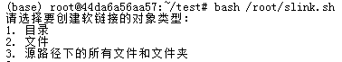
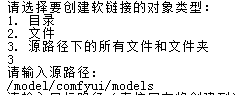
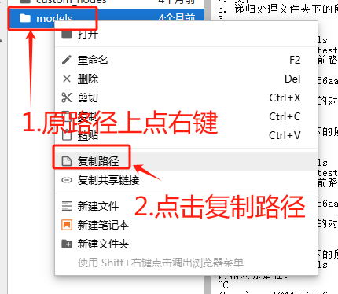
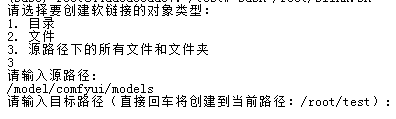

[](https://github.com/AdamShuo/slink/stargazers)
[](https://github.com/AdamShuo/slink/network/members)
[](https://github.com/AdamShuo/slink/blob/main/LICENSE)
[](https://github.com/AdamShuo/slink/issues)
[](https://github.com/AdamShuo/slink/releases)
[](https://github.com/AdamShuo/slink/releases)
[](https://github.com/AdamShuo/slink/actions)
[](https://codecov.io/gh/AdamShuo/slink)
[](https://libraries.io/github/AdamShuo/slink)
[](https://github.com/AdamShuo/slink/graphs/contributors)
[](https://github.com/AdamShuo/slink/commits/main)
[](https://github.com/AdamShuo/slink/pulse)

# 使用指南

## 功能简介
Slink 是一个轻量级的项目，是一个用于在Linux环境下创建软链接（符号链接）的 Bash 脚本，旨在创建大量软链接时，节省输入命令行的时间：
1. 为单个目录创建软链接。
2. 为单个文件创建软链接。
3. 将源路径下的所有文件和文件夹按原始结构创建软链接。

## 使用步骤

### 1. 运行脚本
在终端中运行以下命令，以脚本位置在/root/sl.sh为例：
```bash
bash /root/sl.sh
```

### 2. 选择操作类型
脚本会提示选择操作类型：
```
请选择要创建软链接的对象类型：
1. 目录
2. 文件
3. 源路径下的所有文件和文件夹
```
输入对应的数字（1、2 或 3）并按回车。

### 3. 输入源路径
脚本会提示输入源路径：
```
请输入源路径:
```
输入需要创建软链接的目录或文件路径。

### 4. 输入目标路径
脚本会提示输入目标路径，并显示当前路径：
```
请输入目标路径（直接回车将创建到当前路径：/your/current/path）:
```
输入目标路径或直接回车使用当前路径。

### 5. 完成创建
脚本会根据选择自动创建软链接，并显示操作结果。

## 示例截图

### 选择操作类型


### 输入路径（路径最前方如果没有/，需要连续点键盘左箭头键，将光标移动到最前面，手动补上）


### 路径复制方法


### 创建结果


## 注意事项
1. 确保源路径存在且可访问。
2. 目标路径需要有写入权限。
3. 如果目标路径已存在同名文件或目录，操作会失败。

## 常见问题

### 如何解决权限问题？
确保脚本有执行权限：
```bash
chmod +x sl.sh
```

#### 有了执行权限以后，可以省略bash命令：
```bash
./sl.sh #sl.sh在当前路径
/root/sl.sh #sl.sh在/root/下
```

### 如何调试脚本？
可以添加 `-x` 参数运行脚本以显示详细日志：
```bash
bash -x sl.sh
```

## License
This project is licensed under the Apache License 2.0. See the [LICENSE](LICENSE) file for details.